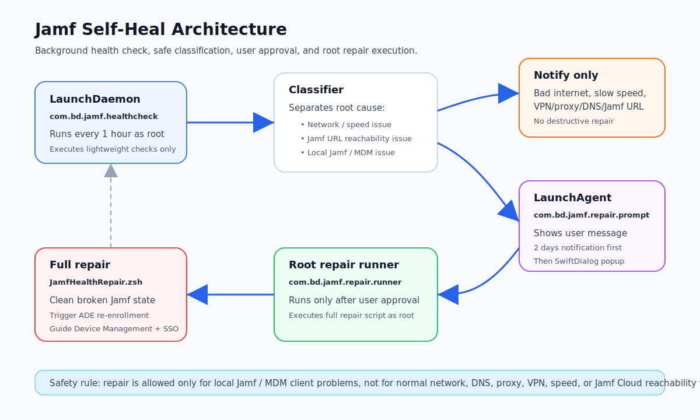
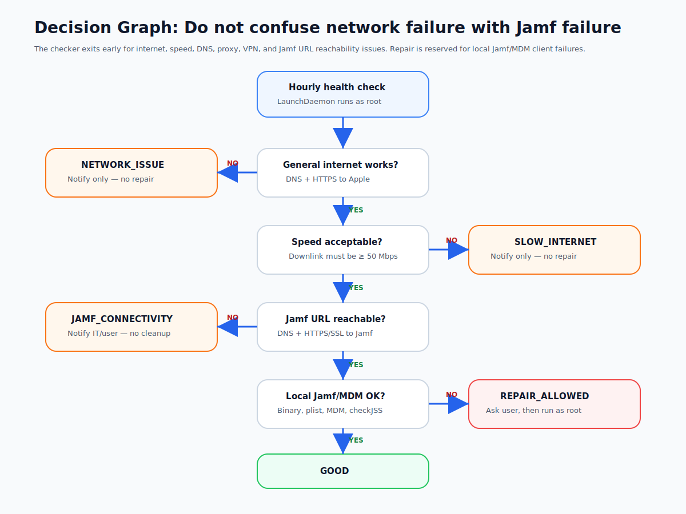
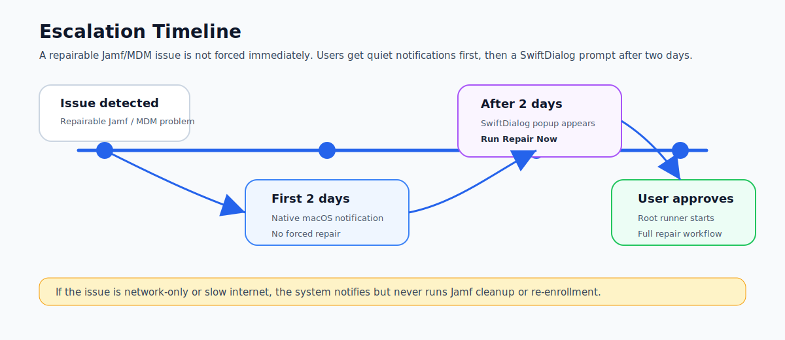

# Jamf Self-Heal for macOS

A production-style macOS self-healing workflow for Jamf-managed Macs.

This project checks Jamf and MDM health every hour, separates real Jamf/MDM problems from normal network problems, notifies the user only when needed, and runs the full repair workflow only after the user approves.



---

## What we are doing

We are building a small self-healing system for macOS devices managed by Jamf Pro.

The project uses:

- A **LaunchDaemon** to run a lightweight health check every 1 hour as root.
- A **classifier** to decide whether the issue is really Jamf/MDM or just network/internet related.
- A **LaunchAgent** to notify the logged-in user.
- **Native macOS notifications** for the first 2 days.
- **SwiftDialog** after 2 days if the user does not act.
- A second **LaunchDaemon** to run the full repair script as root only after user approval.

The full repair script can clean broken Jamf components, attempt MDM cleanup, make the current logged-in user admin when needed, trigger ADE re-enrollment, and guide the user through Device Management / Remote Management and SSO sign-in.

---

## Why we are doing this

In real environments, Jamf issues are not always real Jamf issues.

A Mac may fail `jamf checkJSSConnection` because of:

- bad Wi-Fi
- slow internet
- captive portal
- VPN issue
- proxy issue
- DNS issue
- SSL inspection issue
- temporary Jamf Cloud reachability issue

If a repair script blindly removes Jamf or MDM during these conditions, it can make the device worse.

This project avoids that risk by checking network health first. The repair workflow only becomes available for local Jamf/MDM conditions such as:

- Jamf binary missing
- Jamf plist missing
- Jamf URL missing or wrong
- MDM profile missing
- Jamf local trust/client issue while internet and Jamf HTTPS are reachable



---

## What we get from this

This workflow gives IT teams:

- hourly Jamf health monitoring
- fewer false Jamf repair attempts
- safer user-driven remediation
- clear separation between network issues and Jamf client issues
- 2-day soft notification window before stronger popup
- root repair execution without giving standard users permanent admin rights
- guided ADE / Remote Management re-enrollment experience
- logs for troubleshooting and audit

For users, it provides a simple message instead of asking them to run terminal commands.

---

## High-level workflow

```text
Every 1 hour
  ↓
LaunchDaemon runs JamfHealthCheckLite.zsh
  ↓
Classifier checks:
  - General internet
  - Internet speed
  - Jamf URL DNS / HTTPS
  - Local Jamf binary and plist
  - MDM enrollment profile
  - jamf checkJSSConnection
  ↓
If internet or Jamf URL connectivity issue:
  Notify only, do not repair
  ↓
If local Jamf / MDM issue:
  Store repairable issue state
  ↓
First 2 days:
  User receives native macOS notification
  ↓
After 2 days:
  SwiftDialog popup shows Run Repair Now
  ↓
If user approves:
  Root LaunchDaemon runs JamfHealthRepair.zsh
```



---

## Project structure

```text
jamf-self-heal-project/
├── README.md
├── install.sh
├── uninstall.sh
├── docs/
│   ├── architecture.svg
│   ├── decision-graph.svg
│   └── escalation-timeline.svg
├── scripts/
│   ├── JamfHealthCheckLite.zsh
│   ├── JamfRepairUserPrompt.zsh
│   ├── JamfRepairRootRunner.zsh
│   └── JamfHealthRepair.zsh
├── LaunchDaemons/
│   ├── com.bd.jamf.healthcheck.plist
│   └── com.bd.jamf.repair.runner.plist
└── LaunchAgents/
    └── com.bd.jamf.repair.prompt.plist
```

---

## Components

### 1. `JamfHealthCheckLite.zsh`

Runs every hour as root from LaunchDaemon.

It performs lightweight checks only. It does not repair anything.

It classifies the result as:

| Result | Meaning | Repair allowed? |
|---|---|---:|
| `GOOD` | Jamf, MDM, and connectivity look healthy | No action needed |
| `NETWORK_ISSUE` | General DNS/HTTPS internet issue | No |
| `SLOW_INTERNET` | Downlink below configured threshold | No |
| `JAMF_CONNECTIVITY_ISSUE` | Jamf URL DNS/HTTPS issue | No |
| `JAMF_CLIENT_BROKEN` | Local Jamf binary/plist issue | Yes |
| `MDM_PROFILE_MISSING` | MDM enrollment profile missing | Yes |
| `JAMF_CLIENT_OR_TRUST_ISSUE` | Jamf HTTPS works but `checkJSSConnection` fails | Yes |

### 2. `JamfRepairUserPrompt.zsh`

Runs in the user session from LaunchAgent.

It reads the issue state and decides how to message the user:

- Network/speed/Jamf URL connectivity issue: notify only.
- Repairable Jamf/MDM issue for less than 2 days: native notification.
- Repairable Jamf/MDM issue after 2 days: SwiftDialog popup with **Run Repair Now**.

### 3. `JamfRepairRootRunner.zsh`

Runs as root from LaunchDaemon.

It watches for the user approval flag and runs the full repair script only when the user approves.

### 4. `JamfHealthRepair.zsh`

Runs the full repair workflow.

It can:

- capture Jamf URL before cleanup
- validate connectivity before re-enrollment
- attempt MDM profile removal
- run Jamf framework cleanup
- remove local Jamf leftovers
- make current logged-in user local admin for enrollment flow
- attempt to turn off DND / Focus best effort
- run `profiles renew -type enrollment`
- open Profiles / Device Management
- guide the user through MDM enrollment and SSO
- validate MDM profile after enrollment

---

## Deployment paths

Files are installed here:

```text
/Library/Application Support/BD/JamfRepair/
/Library/LaunchDaemons/com.bd.jamf.healthcheck.plist
/Library/LaunchDaemons/com.bd.jamf.repair.runner.plist
/Library/LaunchAgents/com.bd.jamf.repair.prompt.plist
/var/db/com.bd.jamfrepair/
```

Logs are written here:

```text
/var/log/com.bd.jamfrepair.healthcheck.log
/tmp/com.bd.jamfrepair.userprompt.log
/var/log/com.bd.jamfrepair.runner.log
/var/log/com.bd.jamfrepair.fullrepair.log
```

---

## Requirements

### Required

- macOS managed by Jamf / MDM
- Root deployment through Jamf policy/package, another RMM, or manual admin install
- `zsh`
- `launchd`
- `profiles` command
- `curl`
- `networkQuality` for speed test on supported macOS versions

### Required for 2-day popup

SwiftDialog must be installed at:

```text
/usr/local/bin/dialog
```

Native macOS notifications are used before the 2-day escalation period. SwiftDialog is used only when the issue remains unresolved after 2 days.

---

## Production settings

Edit these values in both:

```text
scripts/JamfHealthCheckLite.zsh
scripts/JamfHealthRepair.zsh
```

```zsh
EXPECTED_JAMF_URL="https://yourcompany.jamfcloud.com"
BAD_SPEED_BELOW_MBPS=50
```

Optional:

```zsh
GOOD_SPEED_ABOVE_MBPS=200
```

Recommended speed meaning:

| Downlink speed | Meaning |
|---:|---|
| Below 50 Mbps | Bad |
| 50–200 Mbps | Average |
| Above 200 Mbps | Good |

---

## Install

```bash
sudo ./install.sh
```

The installer will:

- create required folders
- copy scripts
- copy LaunchDaemon and LaunchAgent plist files
- set permissions
- bootstrap LaunchDaemons
- bootstrap LaunchAgent for the current logged-in user

---

## Uninstall

```bash
sudo ./uninstall.sh
```

The uninstaller will:

- unload LaunchDaemons
- unload LaunchAgent
- remove installed scripts
- remove launchd plist files
- keep or remove state/logs depending on how you customize it

---

## Testing

Force a repairable test issue older than 2 days:

```bash
sudo mkdir -p /var/db/com.bd.jamfrepair
sudo sh -c 'echo JAMF_CLIENT_BROKEN > /var/db/com.bd.jamfrepair/issue_type'
sudo sh -c 'echo Jamf binary test failure > /var/db/com.bd.jamfrepair/issue_reason'
sudo sh -c 'echo true > /var/db/com.bd.jamfrepair/issue_repair_allowed'
sudo sh -c "echo $(( $(date +%s) - 172900 )) > /var/db/com.bd.jamfrepair/issue_first_detected_epoch"
```

Kickstart the user prompt LaunchAgent:

```bash
USER_NAME="$(stat -f%Su /dev/console)"
USER_ID="$(id -u "$USER_NAME")"
launchctl kickstart -k gui/$USER_ID/com.bd.jamf.repair.prompt
```

Kickstart the hourly health checker:

```bash
sudo launchctl kickstart -k system/com.bd.jamf.healthcheck
```

---

## Safety behavior

The full repair script does **not** run for:

- bad internet
- slow internet below threshold
- Jamf URL DNS failure
- Jamf URL HTTPS/SSL failure
- likely VPN/proxy/captive portal issue

This is intentional.

Repair only runs for local Jamf/MDM client issues and only after user approval.

---

## Break-glass limitations

This project is a proactive self-healing design. It must be deployed before the device is fully broken.

It may not help if all of these are true:

```text
MDM profile is broken or missing
User is not admin
Support tooling was not already deployed
No other root-capable RMM/security agent is available
```

In that case, recovery needs another path:

- Jamf Pro MDM command if MDM channel still works
- another root-capable tool such as CrowdStrike RTR, Intune, SSH, ARD, or RMM
- physical IT support
- erase and ADE re-enroll

---

## Security notes

- Root repair is separated from user prompt.
- User approval only creates a flag.
- Root LaunchDaemon performs the privileged action.
- Repair lock prevents duplicate repair runs.
- Network conditions are classified before Jamf cleanup.
- The script logs results for audit and troubleshooting.

---

## References

- Apple launchd daemon and agent documentation: https://developer.apple.com/library/archive/documentation/MacOSX/Conceptual/BPSystemStartup/Chapters/CreatingLaunchdJobs.html
- SwiftDialog command file and progress updates: https://github.com/swiftDialog/swiftDialog/wiki/Updating-Dialog-with-new-content
- SwiftDialog exit codes: https://github.com/swiftDialog/swiftDialog/wiki/Exit-codes
- Jamf unmanaging computers / Remove MDM Profile: https://learn.jamf.com/r/en-US/jamf-pro-documentation-current/Unmanaging_Computers
- Jamf MDM-enabled user modification notes for unremovable MDM profile: https://learn.jamf.com/r/en-US/jamf-pro-documentation-current/MDM-Enabled_User_Modification
- macOS `networkQuality` usage examples: https://nicolaiarocci.com/macos-networkquality-tool/

---

## Codex prompt to continue this project

Use this prompt in Codex when you want to improve the repo:

```text
You are working on a macOS Jamf self-healing project.

Goal:
Improve the project without changing the safety model.

Safety model:
- LaunchDaemon runs hourly lightweight checks as root.
- Network and speed issues must not trigger Jamf cleanup.
- Jamf URL DNS/HTTPS issue must not trigger Jamf cleanup.
- Full repair is allowed only for local Jamf/MDM client issues.
- First 2 days: native notification only.
- After 2 days: SwiftDialog popup.
- Full repair runs only after user clicks Run Repair Now.

Please review scripts for:
- shellcheck-style cleanup
- safer quoting
- stale lock handling
- better logs
- macOS version compatibility
- clear README updates
- no destructive behavior for network-only failures
```
